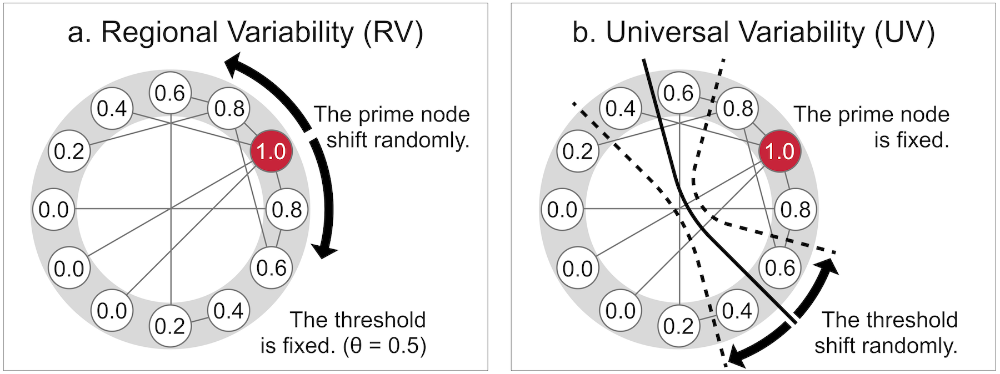

# Environmental variability promotes the evolution of cooperation among geographically dispersed groups on dynamic networks

This repository contains all the source code utilized in the following study:

- **Title**: Environmental variability promotes the evolution of cooperation among geographically dispersed groups on dynamic networks
- **Author**: [Masaaki Inaba](https://www.researchgate.net/profile/Masaaki-Inaba-3), Eizo Akiyama
- **Published**: Under review
- **Journal**: Preprint (arXiv)
- **DOI**: https://doi.org/10.48550/arXiv.2411.12348
- **Citation**: Inaba, M., & Akiyama, E. (2024). Environmental variability promotes the evolution of cooperation among geographically dispersed groups on dynamic networks. arXiv preprint arXiv:2411.12348.

## Abstract

The evolutionary process that led to the emergence of modern human behaviors during the Middle Stone Age in Africa remains enigmatic.
While various hypotheses have been proposed, we offer a new perspective that integrates the variability selection hypothesis (VSH) with the evolution of cooperation among human groups.
The VSH suggests that human adaptability to fluctuating environments was a primary force driving the development of key evolutionary traits.
However, the mechanisms by which environmental variability (EV) influenced human evolution, particularly the emergence of large-scale and complex cooperative behaviors, are not yet fully understood.
To explore the connection between intensified EV and the evolution of intergroup cooperation, we analyzed three stochastic models of EV:
(i) Regional Variability (RV), where resource-rich areas shift while overall resource levels remain stable;
(ii) Universal Variability (UV), where overall resource levels fluctuate but resource-rich areas remain stable; and
(iii) Combined Variability (CV), where both resource-rich areas shift and overall resource levels fluctuate.
Our results show that RV strongly promotes cooperation, while UV has a comparatively weaker effect.
Additionally, our findings indicate that the coevolution of cooperation and network structures is crucial for EVs to effectively promote cooperation.
This study proposes a novel causal link between EV and the evolution of cooperation, potentially setting a new direction for both theoretical and empirical research in this field.

